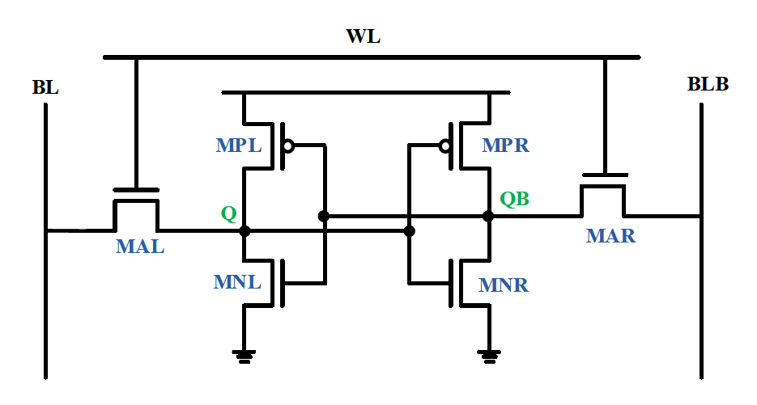

# Design and Analysis of 7T SRAM Cell and Peripheral Circuitry using Google SKY130 PDK

This repository contains the development and analysis of 7T SRAM using the eSIM tool. The 7T SRAM cell is designed on 130nm VLSI fabrication technology. This project was developed during the [IIT Bombay Mixed Signal Design Hackathon](https://esim.fossee.in/mixed-signal-soc-design-marathon).
# Table of Contents
- [Introduction](#introduction)
  - [Problem Statement](#problem-statement)
- [Basics of SRAM](#basics-of-sram)
- [Tools Used](#tools-used)
- [SRAM Cell Design](#sram-cell-design)
- [SRAM Cell Analysis](#sram-cell-analysis)
  - [HSNM](#hsnm)
- [Scaling](#scaling)
- [Decoder Circuit](#3:8 Decoder)
- [Conclusion](#conclusion)
- [Author](#author)
- [Acknowledgements](#acknowledgements)
- [References](#references)

# Introduction
SRAMs are the type of random access memories. They store information in the form of static latch (cross-coupled inverters). They don't require periodic refresh and have short access delays and low power consumption. Due to these properties, they are a better contender for cache memories inside the processors and microcontrollers. They are usually present in various sizes ranging from several KBs to a few MBs'.
## Problem Statement

Development and analysis of a 7T SRAM cell on 130nm fabrication technology using eSIM.
1. Plot the various signal to noise margins.
2. Determine the access time.
3. Calculate the area estimates.

# Basics of SRAM

Let us first understand how a [6T SRAM](images/6t.png) cell works.  It consists of two cross-coupled inverters (MNL, MPL and MNR, MPR) and two access transistors at its complementary nodes Q and QB. The two bit lines (BL and BLB) are connected through access transistors. The access transistors are controlled by wordline (WL). Wordline is set 1 or 0 according to the operation needed. 1 for write operation and 0 for read as can be better understood by the following table.

| Control Signal  | Operation | Operation | Operation | Operation |
| --- | --- | --- | --- | --- |
|     | Write '0' | Write '1' | Read | Hold |
| BL  | 0 | 1 | Pre | 1|
| BLB | 1 | 0 | Pre | 1|
| WL  | 1 | 1 | 1   | 0|

- 6T SRAM cell



- 6T SRAM cell


# 3:8 Decoder

```
module mud_dec_3to8(input clk, enb,
		    input reg [2:0] ad_in,
		    output reg [7:0] WL_out);

	always@(posedge clk && enb)
		begin
         		WL_out = 8'b0;
			case (ad_in)
				  3'b000: WL_out = 8'b00000001;
				  3'b001: WL_out = 8'b00000010;
				  3'b010: WL_out = 8'b00000100;
				  3'b011: WL_out = 8'b00001000;
				  3'b100: WL_out = 8'b00010000;
				  3'b101: WL_out = 8'b00100000;
				  3'b110: WL_out = 8'b01000000;
				  3'b111: WL_out = 8'b10000000;
				  default: WL_out =8'b00000000;
			endcase
		end
endmodule
```


# 4:1 Multiplexer


# Conclusion

A schmitt trigger-based 10T SRAM is successfully designed using synopsys custom compiler software. The read, write and hold operations of the SRAM are successfully verified. Also, an analysis of seven critical design parameters is carried out. It is found that the SRAM performs well on the analysed parameters. However, weak write operation fault persists and can be mitigated through high input voltages.

# Author
[**Mohammad Mudakir Fazili**](https://www.linkedin.com/in/mudakirfazili14/), *M.Tech Micro-electronics*, NIT Srinagar                                                                                           
*mudakirfazili@gmail.com*

# Acknowledgements
1. [IIT Hyderabad](https://iith.ac.in/)
2. [VLSI System Design Corporation](https://www.vlsisystemdesign.com/)
3. [Synopsys](https://www.synopsys.com/)

A special vote of thanks to **Kunal Ghosh** (founder VSD), **Chinmay panda** (IIT Hyderabad), **Sameer Durgoji** (NIT Karnataka)

# References
