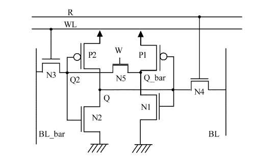

# Design and Analysis of 7T SRAM Cell and Peripheral Circuitry using Google SKY130 PDK

This repository contains the development and analysis of 7T SRAM using the eSIM tool. The 7T SRAM cell is designed on 130nm VLSI fabrication technology. This project was developed during the [IIT Bombay Mixed Signal Design Hackathon](https://esim.fossee.in/mixed-signal-soc-design-marathon).
# Table of Contents
- [Introduction](#introduction)
  - [Problem Statement](#problem-statement)
- [Basics of SRAM](#basics-of-sram)
- [Tools Used](#tools-used)
- [SRAM Cell Design](#sram-cell-design)
- [Decoder Circuit](#decoder-circuit)
- [Scaling and Integration](#scaling-and-integration)
- [Conclusion](#conclusion)
- [Author](#author)
- [Acknowledgements](#acknowledgements)
- [References](#references)

# Introduction
SRAMs are the type of random access memories. They store information in the form of static latch (cross-coupled inverters). They don't require periodic refresh and have short access delays and low power consumption. Due to these properties, they are a better contender for cache memories inside the processors and microcontrollers. They are usually present in various sizes ranging from several KBs to a few MBs'.
## Problem Statement

Development and analysis of a 7T SRAM cell on 130nm fabrication technology using eSIM.
1. Verify the read and write operations
2. Design digital peripheral circuitry.
3. Integration and verification.

# Basics of SRAM

Let us first understand how a [6T SRAM](images/6t.png) cell works.  It consists of two cross-coupled inverters (MNL, MPL and MNR, MPR) and two access transistors at its complementary nodes Q and QB. The two bit lines (BL and BLB) are connected through access transistors. The access transistors are controlled by wordline (WL). Wordline is set 1 or 0 according to the operation needed. 1 for write operation and 0 for read as can be better understood by the following table.

| Control Signal  | Operation | Operation | Operation | Operation |
| --- | --- | --- | --- | --- |
|     | Write '0' | Write '1' | Read | Hold |
| BL  | 0 | 1 | Pre | 1|
| BLB | 1 | 0 | Pre | 1|
| WL  | 1 | 1 | 1   | 0|

- 6T SRAM cell


A novel 7T SRAM cell is designed to reduce the activity factor of discharging the bit line pair during a write operation. Single ended read and write operations are performed. Read SNM is significantly improved.

- 6T SRAM cell


| Control Signal  | Operation | Operation | Operation | Operation |
| --- | --- | --- | --- | --- |
|     | Write '0' | Write '1' | Read | Hold |
| BL  | 0 | 1 | Pre | 1|
| BLB | 1 | 0 | Pre | 1|
| WL  | 1 | 1 | 0   | 0|
| WR  | 0 | 0 | 1   | 1|
| R   | 0 | 0 | 1   | 0|


# Tools Used
eSIM software was provided over the remote desktop connection to the participants of this hackathon. Also, a Google-Skywater 130nm PDK was provided that included the model files of the respective design elements like NMOS, PMOS, BJT etc. The digital components were designed using the verilog in Makerchip and then converted to spice using NgVeri software.
- eSIM Software                                              

Opensource softwares integrated in eSIM:
- Python
- KiCad
- Makerchip
- NGHDL

# SRAM Cell Design

The [schematic](images/7t.png) of the primary cell is designed using 7 transistors (5 NMOS and 2 PMOS). Ports are created for inputs, outputs and power supply. Finally, a symbol is created from the schematic. This symbol is then further used to first analyze the cell metrics; then, it can be used to scale the design to realize n-bit SRAM.

- 7T SRAM cell


The netlist of the 10T SRAM cell is:
```
xsc2 q qb net-_sc2-pad3_ vdd sky130_fd_pr__pfet_01v8_lvt 
xsc5 net-_sc2-pad3_ q net-_sc4-pad1_ vdd sky130_fd_pr__pfet_01v8_lvt 
xsc3 q qb gnd gnd sky130_fd_pr__nfet_01v8_lvt 
xsc6 gnd q net-_sc4-pad1_ gnd sky130_fd_pr__nfet_01v8_lvt 
xsc1 qb wl blb gnd sky130_fd_pr__nfet_01v8_lvt 
xsc7 bl r q gnd sky130_fd_pr__nfet_01v8_lvt 
xsc4 net-_sc4-pad1_ wr qb gnd sky130_fd_pr__nfet_01v8_lvt 
* s c m o d e
xsc9 net-_sc2-pad3_ vdd vdd sky130_fd_pr__res_generic_nd 
xsc8 blb gnd sky130_fd_pr__cap_mim_m3_1 
xsc10 bl gnd sky130_fd_pr__cap_mim_m3_1 
```
The above circuit is simulated and the [figure](images/write0and1.png) depicts the successful write 0 and write 1 operation. The circuit setup is done by connecting the corresponding inputs, outputs, and power supply as mentioned in the following table.

| Parameter | Value |
| --- | --- |
| Voltage Supply (Vdd)  | 1.8v  |
| Rise Time | 10ns  |
| Bit-line Period (BL and BLB)  | 50ns |
| Word-line Period (WL) | 50ns |

- Write 0 and 1 on 7T SRAM cell


- Read 0 on a 7T SRAM cell


- Read 1 on a 7T SRAM cell


# Decoder Circuit
A decoder is designed in the makerchip and then converted to spice using NgVeri software. The verilog coge for the decoder is given below:

```
module mud_dec_3to8(input clk, enb,
		    input reg [2:0] ad_in,
		    output reg [7:0] WL_out);

	always@(posedge clk && enb)
	begin
         	WL_out = 8'b0;
		case (ad_in)
			3'b000: WL_out = 8'b00000001;
			3'b001: WL_out = 8'b00000010;
			3'b010: WL_out = 8'b00000100;
			3'b011: WL_out = 8'b00001000;
			3'b100: WL_out = 8'b00010000;
			3'b101: WL_out = 8'b00100000;
			3'b110: WL_out = 8'b01000000;
			3'b111: WL_out = 8'b10000000;
			default: WL_out =8'b00000000;
		endcase
	end
endmodule
```
The spice model is then tested using the schematic editor and care has to be taken to connect digital blocks to analog blocks using ADC/DAC bridges.
- 3:8 Decoder


- 3:8 Decoder Waveform


# Scaling and Integration


- Scaled and Integrated 16-byte memory.


# Conclusion

A 7T SRAM is successfully designed using eSIM software. The read, write and hold operations of the SRAM are successfully verified. It is found that the SRAM performs well on the analysed parameters.

# Author
[**Mohammad Mudakir Fazili**](https://www.linkedin.com/in/mudakirfazili14/), *M.Tech Micro-electronics*, NIT Srinagar                                                                                           
*mudakirfazili@gmail.com*

# Acknowledgements
1. [IIT Bombay](https://www.iitb.ac.in/)
2. [VLSI System Design Corporation](https://www.vlsisystemdesign.com/)
3. [FOSSEE](https://fossee.in/)

A special vote of thanks to **Kunal Ghosh** (founder VSD).

# References
- Aly, Ramy E., and Magdy A. Bayoumi. "Low-power cache design using 7T SRAM cell." IEEE Transactions on Circuits and Systems II: Express Briefs 54.4 (2007): 318-322.
